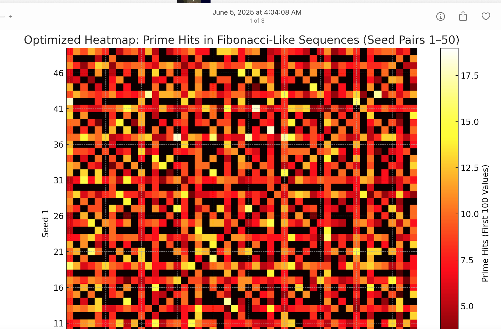

# Prime Finder via Fibonacci‑Like Operator (FLO)

This repository implements **two high‑performance pipelines**—one in **Python** and one in **C (GMP)**—that operationalize an empirical strategy for **prioritizing prime‑rich integer sequences** derived from a *Fibonacci‑Like Operator (FLO)*.

---

## Concept & Rationale

**Fibonacci‑Like Operator (FLO):** Choose a seed pair `(s1, s2)` with integers `>= 1`. Generate an infinite sequence by:
```
x0 = s1
x1 = s2
x_{n+1} = x_n + x_{n-1}
```
(identical recursion to Fibonacci, but *seeded arbitrarily*).

**Observation:** FLO sequences—depending on the seed pair—appear to demonstrate **non‑uniform prime hit rates** over initial windows (e.g., first 100 terms). Empirically, some seed pairs yield **higher prime density** in early terms than others. The working hypothesis is that **ranking seed pairs by early prime‑density** allows us to **prioritize** sequences that more frequently visit prime values, thereby discovering **large primes faster** than naïve random sampling.

**Pipeline:**  
1) **Seed Scan:** Sweep seed pairs in a configured range (e.g., 1–50), generate the first `K` FLO terms (default `K=100`), and **count primes**. Persist stats and print a **ranked leaderboard** of seed pairs by *prime hits* and *prime density*.
2) **Focused Search:** For the top‑N seed pairs, continue the sequence far beyond the initial window, **testing primality** as term sizes grow (thousands of digits). The search can be guided by a **target digit length**.
3) **Results & Reproducibility:** Mirror the MATLAB terminal printouts with structured logs and write **`results.txt`** (or **`batch-results.txt`**) in each run directory.

**Why this may work:** FLO sequences are structured linear recurrences with a deterministic arithmetic lattice. Because each term grows roughly exponentially, they traverse large integer space at varying modular footprints depending on seeds. The **modular residue patterns** induced by specific seeds may **avoid common composite structures more often**, yielding **statistical advantages** for prime discovery in practice. The heatmap snapshot below visually suggests *fractal‑like banding* consistent with modular structure across seed pairs and term windows.

---

## Fractal Heatmap: Prime Hits Across Seed Pairs



**Caption:** *Each cell encodes the count of primes among the first 100 terms of the FLO sequence seeded by `(seed1, seed2)`. Warmer colors indicate more prime hits. The banded, quasi‑fractal pattern reflects residue‑class structure propagated by the linear recurrence, which appears to persist across seed ranges and resolutions.*

---

## Files

- `README.md` (this document)  
- `screenshot.png` (the supplied visualization)  
- Source implementing:
  - **Probabilistic Miller–Rabin** with deterministic bases for small ranges and strong probable‑prime testing for arbitrarily large integers.
  - **Fast modular exponentiation** (`pow(a, d, n)` in Python; `mpz_powm` in C/GMP).
  - **Streaming FLO generation** without storing the entire sequence in memory.
- **Outputs:** `results.txt` (single run) or `batch-results.txt` (multi‑seed scan).

---

## Reproducibility & Parity with MATLAB

Both implementations **mirror the MATLAB workflow**:
- Identical FLO recursion and seed sweeps.
- Equivalent printing/summary (leaderboards, top‑N selection, per‑seed stats).
- Results written to `results.txt` / `batch-results.txt`.

---

## Performance Engineering

- **Python**
  - Built on Python's **arbitrary‑precision integers** (no string math required).
  - **Vectorless streaming** to avoid memory blowups.
  - **Optimized Miller–Rabin** with common small‑prime trial division and fast modular exponentiation.
  - Optional **multiprocessing** for seed scanning on multi‑core CPUs.

- **C (with GMP)**
  - Uses **GNU MP (GMP)** `mpz_t` big integers and **`mpz_probab_prime_p`** for high‑speed primality testing.
  - Tight loop FLO generation with minimal allocations by reusing `mpz_t` temporaries.
  - Designed for **long‑running** hunts for 10k+ digit primes.

> **Note:** The C build requires GMP (`libgmp`) to be installed. Installation instructions are included below.

---

## Install & Run

### Python
```bash
cd prime-finder-python
python3 -m venv .venv && source .venv/bin/activate
python main.py --seed-min 1 --seed-max 50 --window 100 --top 25 --target-digits 4000 --max-terms 200000
# Add --workers <N> to parallelize the seed scan stage.
```

### C (GMP)
Install GMP (examples):
- macOS (Homebrew): `brew install gmp`
- Ubuntu/Debian: `sudo apt-get update && sudo apt-get install -y libgmp-dev`
- Fedora: `sudo dnf install gmp-devel`

Build & run:
```bash
cd prime-finder-c
make
./prime_finder --seed-min 1 --seed-max 50 --window 100 --top 25 --target-digits 4000 --max-terms 200000
```

---

## Outputs

- `batch-results.txt` — full seed scan leaderboard and stats
- `results.txt` — focused search logs; every found probable prime is recorded with digits, seed, index, and test strength
- Console output mirrors MATLAB‑style summaries for live observability

---

## Notes on Primality
Both implementations use **probable‑prime (strong pseudoprime) tests** by default (Miller–Rabin). You can increase the number of bases/rounds to reduce error probability arbitrarily (e.g., < 2^-128). For determinism, you can set fixed bases, or promote candidates to **ECPP**/**AKS** externally if a *provable* certificate is required.

---