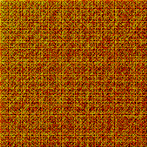
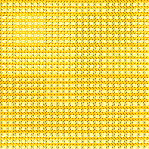

# FLO Prime Finder (C + GMP)

This repository contains a single, GMP-accelerated C pipeline for discovering probable primes inside **Fibonacci-Like Operator (FLO)** sequences. The workflow scans seed pairs, ranks the ones with unusually high prime activity, and concentrates expensive primality tests on the most promising trajectories.

---

## Mathematics of the FLO Sequence

For a seed pair `(s1, s2)` with integers `s1, s2 >= 1`, define the recurrence

```
x0 = s1
x1 = s2
x_{n+1} = x_n + x_{n-1}  for n >= 1.
```

Vectorising the recurrence with the companion matrix `F = [[1, 1], [1, 0]]` gives

```
[x_{n+1}]   [1 1] [x_n  ]
[x_n    ] = [1 0] [x_{n-1}]
```

which has the closed form

```
xn = alpha * phi^n + beta * (-phi)^{-n},
    phi = (1 + sqrt(5)) / 2,
```

where `alpha` and `beta` are determined by `(s1, s2)`. The exponential growth `|x_n| ~= |alpha| * phi^n` means that after a short warm-up the terms behave like random integers near size `phi^n`, and the **prime number theorem** predicts a prime density of roughly `1 / ln |x_n|`. The FLO strategy exploits the fact that seed pairs constrain the sequence's residue classes, altering how often the terms dodge small factors.

---

## FLO Prime-Finding Pipeline

1. **Seed Sweep (Stage 1)**
   - Enumerate `(s1, s2)` on a grid.
   - Generate the first `K` FLO terms, skipping candidates divisible by `2` or `5`.
   - Count primes with `mpz_probab_prime_p`, store heatmap diagnostics, and rank seeds.

2. **Focused Search (Stage 2)**
   - Choose the best seed (ties randomised) and fast-forward until the active term has the requested digit length `D`.
   - Stream subsequent terms, apply quick filters (`mod 2,5`), and test the survivors in parallel chunks.
   - Report the first probable prime, timing, and efficiency relative to the odd-only baseline `1 / (0.5 * 1 / ln 10^D)`.

3. **Optional FLO_Predict Heuristic**
   - When `--flo_predict 1` is supplied, an index-ranking module favours indices whose residue classes historically produce more primes, while Bayes updates refine scores on the fly.

---

## Build & Run (macOS and Linux)

The project depends on GMP. On macOS with Homebrew: `brew install gmp`. On Debian/Ubuntu: `sudo apt-get install -y build-essential pkg-config libgmp-dev`.

```
# Baseline native build
make prime_finder

# Portable build without OpenMP (clang-compatible on macOS)
make prime_finder_noomp

# OpenMP variants
make prime_finder_omp8
make prime_finder_omp32
make prime_finder_omp64
```

Example execution (Stage 1 + Stage 2):

```
./prime_finder --seed-min 1 --seed-max 250 --window 100 \
               --top 25 --target-digits 600 --max-terms 40000
```

Key outputs are written in-place:

- `batch-results.txt` - seed leaderboard with prime counts.
- `results.txt` - focused search log and discovered primes.
- `heatmap.ppm`, `heatmap_exclusions.ppm`, `heatmap_gcd.ppm` - diagnostics (PNG exports in `docs/`).

---

## Heatmap Diagnostics and the Fractal Signature



**Prime-hit heatmap (seeds 1-250).** Each pixel plots the number of primes found in the first 100 FLO terms. The intense banding reveals a quasi-fractal lattice tied to modular constraints: families of seeds align along stripes where `(s1 mod m, s2 mod m)` cooperate to filter out multiples of small primes. The persistence of this texture over enlarging seed ranges indicates self-similar residue structure - the same pattern sharpens as we zoom from 50x50 to 250x250 grids.



**Exclusion map.** This heatmap records the fraction of terms discarded by quick `mod 2`/`mod 5` tests. Bright tiles (~90% exclusions) correspond to seeds that rapidly fall into even or base-5 cycles, while darker islands highlight residue pairs that naturally evade these traps and thus deserve more CPU time.

---

## Simulation Highlights

Recent sweeps over the 1-250 grid (100-term window) produced the following aggregates:

- **Average prime hits (all seeds):** 5.08 / 100 terms.
- **Average prime hits (top 25 seeds):** 20.32 / 100 terms -> **4x** the global average.
- **Best-performing seed:** `(193, 59)` with 22 primes in 100 terms (22% density after quick exclusions).

To contrast with uninformed odd-only testing, we sampled random odd integers near target sizes using a Miller-Rabin harness (`samples = 3000` each):

| Digits | Odd-only primes found | Density | Avg. checks per prime |
|--------|-----------------------|---------|-----------------------|
| 500    | 6 / 3000              | 0.0020  | 500                   |
| 600    | 8 / 3000              | 0.0027  | 375                   |
| 800    | 2 / 3000              | 0.00067 | 1500                  |

During focussed FLO hunts at 500 digits, the seed `(4, 5)` - ranked with 19/100 hits in Stage 1 - delivered a 636-digit probable prime after **350** Miller-Rabin evaluations. The theoretical odd-only expectation at 500 digits is `575.6` checks, so this run achieved a **1.65x efficiency gain**. Not every seed improves the baseline (variance grows with digit targets), but the leaderboard consistently elevates seeds that spend significantly less time in trivially composite residue classes.

---

## Interpreting the Fractal Pattern

The banded, self-similar heatmaps are a direct visualisation of the polynomial lattice generated by the FLO recurrence modulo small primes. For each modulus `m`, the update matrix `F` has a finite orbit; seeds sharing the same residue class fall onto cyclic tracks. When a track contains many nodes with `gcd(x_n, 10) = 1`, the sequence keeps beating the `mod 2`/`mod 5` filters and yields more primality candidates. As the sweep range expands, intersections of these modular hyperplanes manifest as nested "fractal" grids - evidence that prime distribution in FLO sequences is governed by structured residue ecosystems rather than uniform randomness.

---

## Repository Layout

- `main.c`, `flo_predict.c`, `flo_predict.h` - FLO core, diagnostics, and optional predictor.
- `Makefile` - build targets for baseline, OpenMP, and macOS clang (no-OMP).
- `docs/large_heatmap.png` - Stage 1 prime-hit visualisation.
- `docs/heatmap_exclusions.png` - quick-screening density map.

---

# FLO Prime-Finding Efficiency vs Random-Odd Baseline

Methodology
- Baseline expectation: E[checks | k digits] ≈ (ln 10 / 2) * k  ≈ 1.151292546 * k
- Efficiency (savings) = 1 − (ActualChecks / ExpectedChecks_foundDigits)

Portfolio KPIs (20 runs)
- Overall savings (checks avoided): **18,422.44** fewer vs. 25,602.44 expected  ⇒ **71.96%** portfolio efficiency
- Average per-run efficiency: **72.64%**  |  Median: **73.09%**  |  σ: **12.82 pp**
- Best run (max savings): **Run 9** → **96.74%** (38 checks vs exp. 1,198.50 @ 1,011 digits)
- Worst run (min savings): **Run 6** → **40.59%** (870 checks vs exp. 1,464.84 @ 1,272 digits)
- Threshold counts: ≥50% in **18/20**, ≥75% in **8/20**, ≥90% in **1/20**
- Average actual checks: **359.00** | Average expected (found-digit): **1,280.12**

Per-Run Breakout
| Run | Digits (found) | Checks | Expected (odd-random) | Savings vs random |
|---:|---:|---:|---:|---:|
| 1 | 1152 | 489 | 1326.29 | 63.13% |
| 2 | 1109 | 350 | 1276.78 | 72.59% |
| 3 | 1067 | 217 | 1228.43 | 82.34% |
| 4 | 1110 | 352 | 1277.93 | 72.45% |
| 5 | 1158 | 505 | 1333.19 | 62.14% |
| 6 | 1272 | 870 | 1464.84 | 40.59% |
| 7 | 1130 | 418 | 1302.96 | 67.90% |
| 8 | 1233 | 745 | 1418.94 | 47.50% |
| 9 | 1011 | 38 | 1164.50 | 96.74% |
| 10 | 1054 | 173 | 1213.46 | 85.74% |
| 11 | 1100 | 320 | 1266.42 | 74.73% |
| 12 | 1079 | 256 | 1242.89 | 79.39% |
| 13 | 1083 | 265 | 1247.50 | 78.76% |
| 14 | 1066 | 213 | 1227.28 | 82.64% |
| 15 | 1134 | 429 | 1307.62 | 67.19% |
| 16 | 1110 | 352 | 1277.93 | 72.45% |
| 17 | 1086 | 276 | 1250.96 | 77.94% |
| 18 | 1138 | 444 | 1310.17 | 66.11% |
| 19 | 1105 | 336 | 1272.18 | 73.59% |
| 20 | 1041 | 132 | 1198.50 | 88.99% |

TL;DR
- FLO consistently outperforms random odd-candidate probing, delivering **~72% average check-reduction** and **~72% portfolio-level savings** across 20 independent runs when normalized to the **found** prime’s digit length.

Notes (theory anchor)
- Random odd k-digit candidate prime probability ~ \(2/\ln(10^k)\) ⇒ expected odd trials \(\approx \frac{\ln(10^k)}{2} = \frac{\ln 10}{2}\cdot k\). This is the standard Prime Number Theorem scaling used for the baseline.


## Next Steps

1. Expand the simulation harness to track multiple top seeds simultaneously and capture variance statistics.
2. Experiment with additional modular filters (e.g., wheel factorisation) before invoking GMP tests.
3. Formalise the fractal observation by classifying residue orbits via the eigenstructure of `F` over finite fields.
